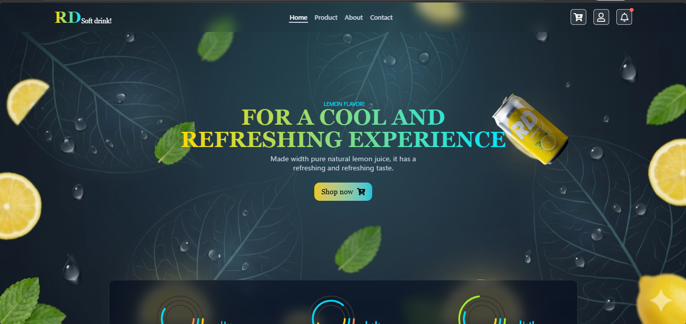

# 🍋Lemon SoftDrink Website (React + TypeScript + Vite)  



A 2D animation softDrink landing page website created using a combination of ** React **, ** TypeScript **, ** Tailwind css ** and ** Gsap **, based on the ** Vite ** build tool.

## 🚀 Live Demo
You can check out the live version of **Lemon SoftDrink** website here:
[View Live Project](https://soft-drink-iota.vercel.app/)

---

---  

## 🌟 Features  

The page will start to animate as soon as it opens. When scrolling, the soft drink bottle will animate as it scrolls. There will be 4 sections: Home, Product, About and Contact. Then you can place an order. You can see the time since the user purchased. You can also see new information in the notification.  

---  

## 🛠️ Tech Stack

- **Vite** - Next Generation Frontend Tooling
- **React** - The library for building component-based User Interfaces
- **Typescript** - A strongly-typed programming language that builds on JavaScript
- **Tailwind css** - A utility-first CSS framework for rapid UI development
- **Gsap** - Industry-standard tool for high-performance animations and ScrollTrigger effects
- **Frame Motion** -  An animation library for production-ready React components (Hover, Tap & Layout transitions)
- **Emailjs** -  A service to send emails directly from the client-side without a backend server
- **Lucide-react** - A collection of beautiful and consistent icons for modern web design
- **React-Toastify** - A popular library for displaying toast notifications in React applications  

--- 

## 🚀 Getting Started  
  
  To run this project on your machine, use the following commands:  

  ### 1. Clone the project  

  ```bash
  git clone https://github.com/kyawzin17/Soft-Drink  
  cd Soft-Drink
  ```  

 ### 2. Install dependencies  
    
    ```bash
    npm install
    ```  
 ### 3. Run the project  
    
    ```bash
    npm run dev
    ```  
 ### 4. Open the project in your browser  
    
    ```bash
    http://localhost:3600
    ```  

---  

## 📁Folder Structure
```
|--my-app
    |--public
        |--bc.png
        |--web-img.png
    |--src
        |--components
            |--CircleAni.tsx
        |--pages
            |--About.tsx
            |--Cart.tsx
            |--Contact.tsx
            |--Header.tsx
            |--Home.tsx
            |--Noti.tsx
            |--Product.tsx
            |--User.tsx
        |--App.css
        |--App.tsx
        |--index.css
        |--main.tsx
    |--.gitignore
    |--.env
    |--eslint.config.js
    |--index.html
    |--package-lock.json
    |--package.json
    |--README.md
    |--tsconfig.app.json
    |--tsconfig.json
    |--tsconfig.node.json
    |--vite.config.ts
```
---  

## 📦 Production Build

``` 
npm run build

```  

   